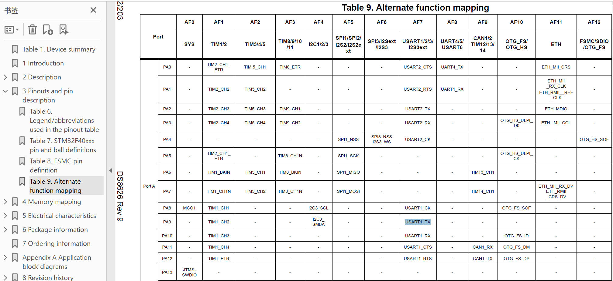
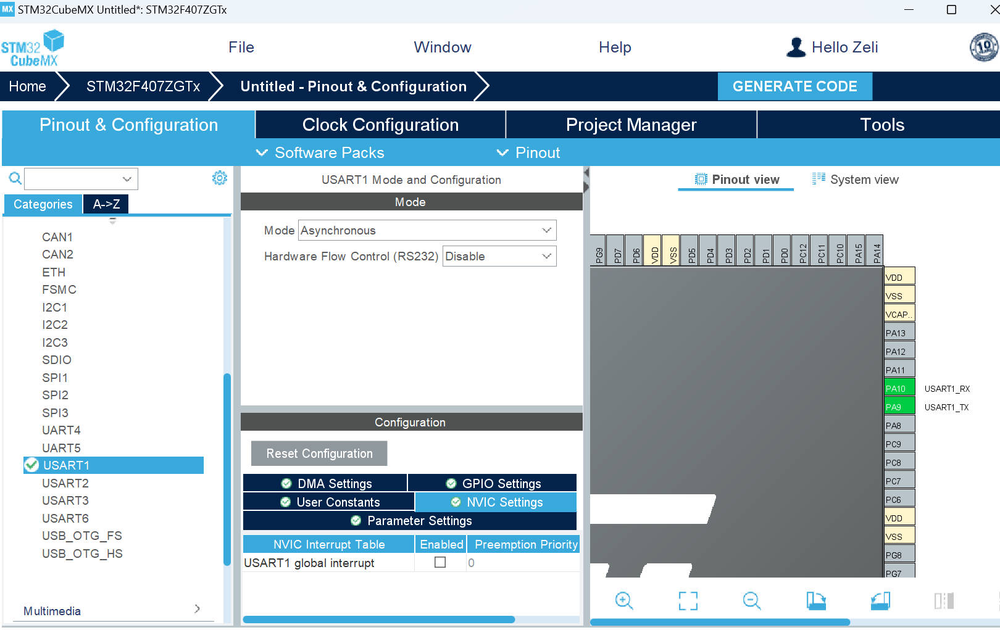
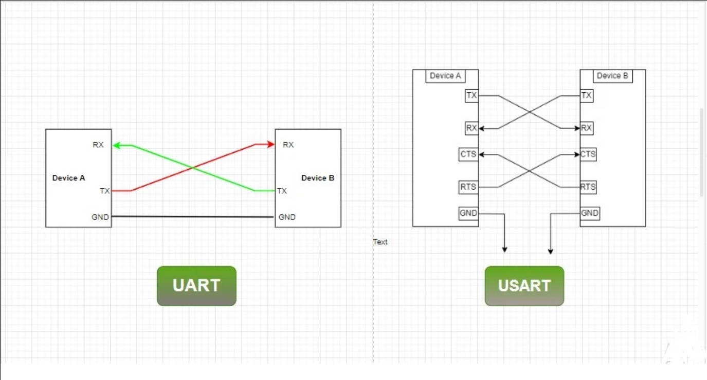
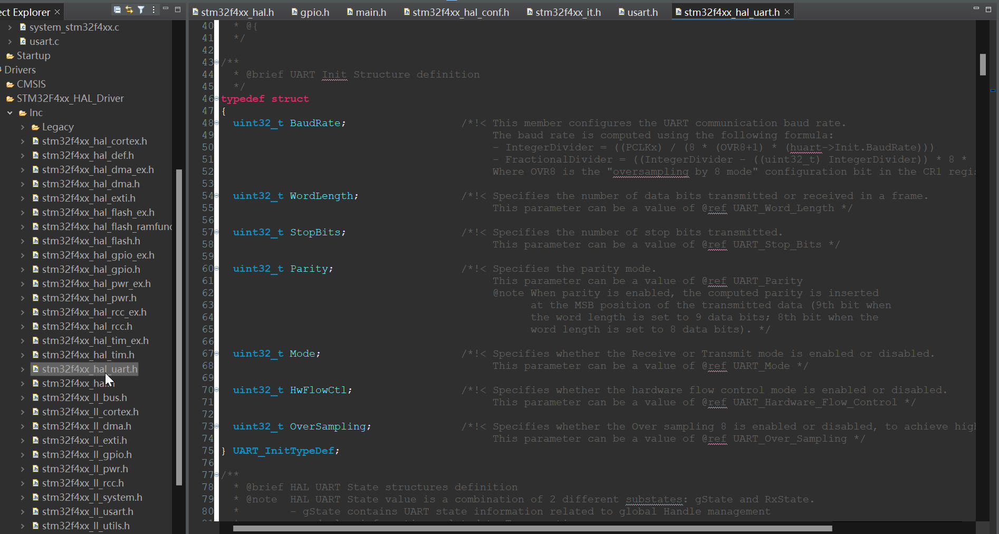
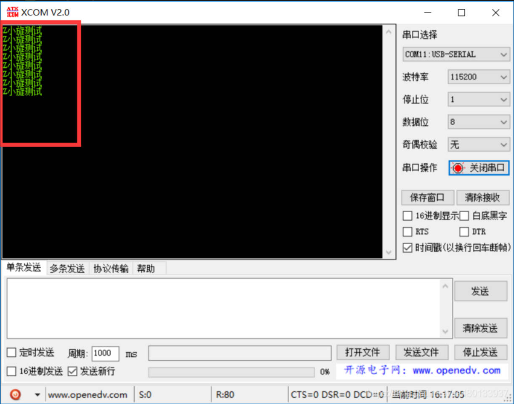
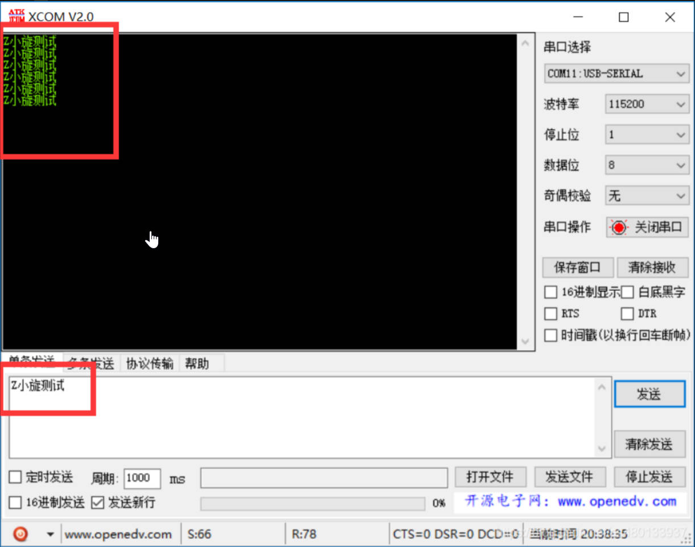

# 04. HAL Library UART Serial Communication


=============================================================

Translate From: https://blog.csdn.net/as480133937/article/details/99073783

## Preparation:

Tools used :

1. Chip: STM32F407ZET6

2. STM32CubeMx software

3. IDE: MDK-Keil software

4. STM32F1xx/STM32F4xx HAL library 

5. Serial port: Use USART1 PA9, PA10



Check the datasheet find the table `Alternate Function Mapping`, as we can see , the PA9 provides the alternative function (AF7) for USART1_TX

..............................................

**2Set up the serial port**

Automatically set up the USART1 port according to the `AF Mapping Table`



### USART Explanation




> - **UART vs. USART:** UART (Universal Asynchronous Receiver/Transmitter) is for asynchronous communication. USART (Universal Synchronous Asynchronous Receiver/Transmitter) supports both asynchronous and synchronous communication, making it more versatile.
> - **Baud Rate:** The baud rate determines the speed of data transmission and reception. STM32 UART/USART peripherals support programmable baud rates to match the communication speed of the connected devices.
> - **Data Frame Configuration:** You can configure data frame parameters, including data bits (7, 8, or 9 bits), stop bits (1 or 2 bits), and parity (even, odd, or no parity).
>
> Reference: https://embeddedthere.com/stm32-uart-usart-tutorial-using-dma-with-hal-code-example/

...........................................

**UART structure definition**



UART name definition . This structure stores all the functions used by UART . The following alias is the alias of the uart serial port we use. The default is huart1
1. Serial port send/receive function

HAL_UART_Transmit (); Serial port sends data, using timeout management mechanism 
HAL_UART_Receive (); Serial port receives data and uses timeout management mechanism
HAL_UART_Transmit_IT (); Serial port interrupt mode transmission  
HAL_UART_Receive_IT (); Receive in serial port interrupt mode
HAL_UART_Transmit_DMA (); serial port DMA mode transmission
HAL_UART_Transmit_DMA (); Serial port DMA mode reception

2. Serial port interrupt function

 

```c
HAL_UART_IRQHandler (UART_HandleTypeDef *huart); //Serial port interrupt processing function
HAL_UART_TxCpltCallback (UART_HandleTypeDef *huart); //Serial port send interrupt callback function
HAL_UART_TxHalfCpltCallback (UART_HandleTypeDef *huart); //Serial port sends half interrupt callback function (less used)
HAL_UART_RxCpltCallback (UART_HandleTypeDef *huart); //Serial port receive interrupt callback function
HAL_UART_RxHalfCpltCallback (UART_HandleTypeDef *huart); //Serial port receives half of the callback function (less used)
HAL_UART_ErrorCallback (); Serial port receiving error function
```

```c
HAL_UART_RxCpltCallback(UART_HandleTypeDef *huart);  
```

Function: After the HAL library interrupt is completed, it will not exit directly, but will enter the interrupt callback function, in which the user can set the code.  
After the serial port interrupt reception is completed, this function will be entered . This function is an empty function and the user needs to modify it by himself.

**Serial port interrupt processing function**

```c
HAL_UART_IRQHandler(UART_HandleTypeDef *huart);  
```

Function: Determine and process the received data  to determine whether it is a send interrupt or a receive interrupt , and then send and receive data. Used in the interrupt service function.  

If data is received, the receive interrupt processing function will be executed

```c
 /* UART in mode Receiver ---------------------------------------------------*/
  if((tmp_flag != RESET) && (tmp_it_source != RESET))
  { 
    UART_Receive_IT(huart);
  }
```

If data is sent, the send interrupt processing function will be executed

```c
  /* UART in mode Transmitter ------------------------------------------------*/
  if (((isrflags & USART_SR_TXE) != RESET) && ((cr1its & USART_CR1_TXEIE) != RESET))
  {
    UART_Transmit_IT(huart);
    return;
  }
```


## USART receiving and transmitting

- **Rewrite fget and fput functions in stm32f4xx_hal.c**

```c
/**
  * 函数功能: 重定向c库函数printf到DEBUG_USARTx
  * 输入参数: 无
  * 返 回 值: 无
  * 说    明：无
  */
int fputc(int ch, FILE *f)
{
  HAL_UART_Transmit(&huart1, (uint8_t *)&ch, 1, 0xffff);
  return ch;
}
 
/**
  * 函数功能: 重定向c库函数getchar,scanf到DEBUG_USARTx
  * 输入参数: 无
  * 返 回 值: 无
  * 说    明：无
  */
int fgetc(FILE *f)
{
  uint8_t ch = 0;
  HAL_UART_Receive(&huart1, &ch, 1, 0xffff);
  return ch;
}
```

**Add in main.c**

```c
 
  while (1)
  {
    /* USER CODE END WHILE */
			printf("Z小旋测试\n");
			HAL_Delay(1000);
    /* USER CODE BEGIN 3 */
  }
```




## UART Receive Interrupt

Because the interrupt receiving function can only trigger a receiving interrupt once, we need to call the interrupt receiving function again in the interrupt callback function.

specific process:
1. Initialize the serial port

2. Call the receive interrupt function for the first time in main

3. **Enter the receiving interrupt, and enter the interrupt callback function after receiving the data**

4. Modify the `HAL_UART_RxCpltCallback` interrupt callback function to process the received data.

5.   The `HAL_UART_Receive_IT` function must be called once in the callback function so that the program can re-trigger the receive interrupt

Function flow chart:

HAL_UART_Receive_IT ( interrupt receiving function )     ->   USART2_IRQHandler(void)( interrupt service function ) -> HAL_UART_IRQHandler(UART_HandleTypeDef *huart)( interrupt handling function ) -> UART_Receive_IT(UART_HandleTypeDef *huart) ( receiving function ) -> HAL_UART_RxCpltCallback(huart);( interrupt callback function )

The HAL_UART_RxCpltCallback function is the callback function that the user needs to rewrite in main.c.

Code:

```c
#include <string.h>
 
#define RXBUFFERSIZE  256     //最大接收字节数
char RxBuffer[RXBUFFERSIZE];   //接收数据
uint8_t aRxBuffer;			//接收中断缓冲
uint8_t Uart1_Rx_Cnt = 0;		//接收缓冲计数
```

Add the interrupt callback function below main.c:

```c
/* USER CODE BEGIN 4 */
 
void HAL_UART_RxCpltCallback(UART_HandleTypeDef *huart)
{
  /* Prevent unused argument(s) compilation warning */
  UNUSED(huart);
  /* NOTE: This function Should not be modified, when the callback is needed,
           the HAL_UART_TxCpltCallback could be implemented in the user file
   */
 
	if(Uart1_Rx_Cnt >= 255)  //溢出判断
	{
		Uart1_Rx_Cnt = 0;
		memset(RxBuffer,0x00,sizeof(RxBuffer));
		HAL_UART_Transmit(&huart1, (uint8_t *)"数据溢出", 10,0xFFFF); 	
        
	}
	else
	{
		RxBuffer[Uart1_Rx_Cnt++] = aRxBuffer;   //接收数据转存
	
		if((RxBuffer[Uart1_Rx_Cnt-1] == 0x0A)&&(RxBuffer[Uart1_Rx_Cnt-2] == 0x0D)) //判断结束位, 0x0D (carriage return) and 0x0A (line feed)
		{
			HAL_UART_Transmit(&huart1, (uint8_t *)&RxBuffer, Uart1_Rx_Cnt,0xFFFF); //将收到的信息发送出去
            while(HAL_UART_GetState(&huart1) == HAL_UART_STATE_BUSY_TX);//检测UART发送结束
			Uart1_Rx_Cnt = 0;
			memset(RxBuffer,0x00,sizeof(RxBuffer)); //清空数组
		}
	}
	
	HAL_UART_Receive_IT(&huart1, (uint8_t *)&aRxBuffer, 1);   //再开启接收中断
}
/* USER CODE END 4 */
```

Explanation for `HAL_UART_RECEIVE_IT`

```c
/**
  * @brief  Receives an amount of data in non blocking mode.
  * @note   When UART parity is not enabled (PCE = 0), and Word Length is configured to 9 bits (M1-M0 = 01),
  *         the received data is handled as a set of u16. In this case, Size must indicate the number
  *         of u16 available through pData.
  * @param  huart Pointer to a UART_HandleTypeDef structure that contains
  *               the configuration information for the specified UART module.
  * @param  pData Pointer to data buffer (u8 or u16 data elements).
  * @param  Size  Amount of data elements (u8 or u16) to be received.
  * @retval HAL status
  */
HAL_StatusTypeDef HAL_UART_Receive_IT(UART_HandleTypeDef *huart, uint8_t *pData, uint16_t Size)
{
  /* Check that a Rx process is not already ongoing */
  if (huart->RxState == HAL_UART_STATE_READY)
  {
    if ((pData == NULL) || (Size == 0U))
    {
      return HAL_ERROR;
    }

    /* Set Reception type to Standard reception */
    huart->ReceptionType = HAL_UART_RECEPTION_STANDARD;

    return (UART_Start_Receive_IT(huart, pData, Size));
  }
  else
  {
    return HAL_BUSY;
  }
}
```


