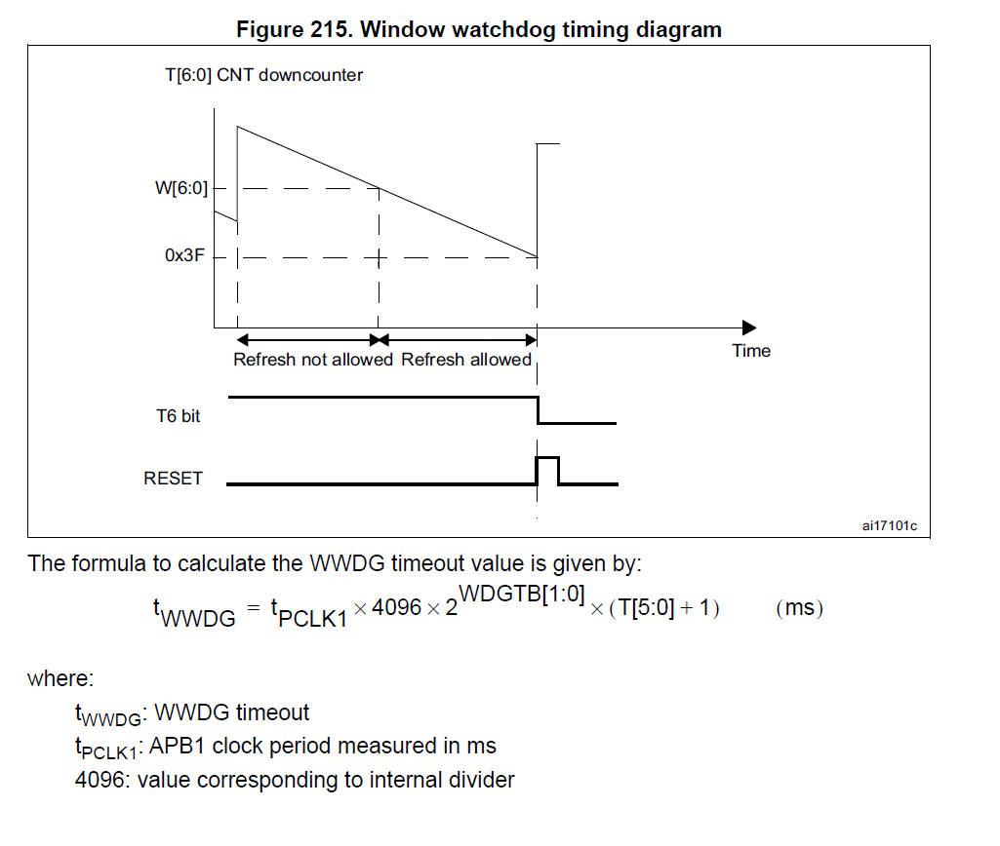

# 05. HAL Library Watch Dog


**Preparation:**

1. Chip: STM32F407ZET6
2. STM32CubeMx software
3. IDE: MDK-Keil software
4. STM32F1xx/STM32F4xx HAL library 

Watchdog
 In a microcomputer system composed of a single-chip microcomputer, the operation of the single-chip microcomputer is often interfered by the external electromagnetic field, causing the program to run away and fall into an infinite loop; or because of a bug in the user configuration code, the chip cannot work properly. In order to monitor the running status of the single-chip microcomputer in real time, a module or chip specifically used to monitor the running status of the single-chip microcomputer program was created, commonly known as a "watchdog". 

Simply put: the essence of the watchdog is a timing counter. After the counter is enabled, it keeps accumulating. Feeding the watchdog is to rewrite the value of the counter, and the counter will accumulate again.

If the dog feeding signal is not received within a certain period of time (indicating that the MCU has hung up), the processor will automatically reset and restart (send a reset signal)

**STM32 built-in watchdog**

STM32 has two built-in watchdogs, providing higher security, time accuracy and flexibility of use. Two watchdog devices (independent watchdog, window watchdog) can be used to detect and solve faults caused by software errors. When the counter reaches a given timeout value, an interrupt is triggered (only applicable to window watchdog) or a system reset is generated.

- The **independent watchdog (IWDG)** is driven by a dedicated low-speed clock (LSI) (40kHz), and it is still effective even if the main clock fails . The independent watchdog is suitable for applications where the watchdog needs to work completely independently outside the main program and has low requirements for time accuracy.
- The **window watchdog (WWDG)** is driven by a clock divided from the APB1 clock (36MHz). It detects abnormal late or early operation of the application through a configurable time window. The window watchdog is most suitable for applications that require the watchdog to function in a precise timing window.


## IWDG - Independent Watchdog

#### 1 Setting up RCC


#### 2 Configuring IWDG


   IWDG clock pre-division factor 4   
 Counter reload value 4095    RLR
Exceed (overflow) time calculation:

 Tout=((4×2^PRER) ×RLR)/LSI clock frequency


Code:

```c
#define HAL_IWDG_DEFAULT_TIMEOUT        (((6UL * 256UL * 1000UL) / LSI_VALUE) + ((LSI_STARTUP_TIME / 1000UL) + 1UL))

HAL_StatusTypeDef HAL_IWDG_Init(IWDG_HandleTypeDef *hiwdg)
{
  uint32_t tickstart;

  /* Check the IWDG handle allocation */
  if (hiwdg == NULL)
  {
    return HAL_ERROR;
  }

  /* Check the parameters */
  assert_param(IS_IWDG_ALL_INSTANCE(hiwdg->Instance));
  assert_param(IS_IWDG_PRESCALER(hiwdg->Init.Prescaler));
  assert_param(IS_IWDG_RELOAD(hiwdg->Init.Reload));

  /* Enable IWDG. LSI is turned on automatically */
  __HAL_IWDG_START(hiwdg);

  /* Enable write access to IWDG_PR and IWDG_RLR registers by writing
  0x5555 in KR */
  IWDG_ENABLE_WRITE_ACCESS(hiwdg);

  /* Write to IWDG registers the Prescaler & Reload values to work with */
  hiwdg->Instance->PR = hiwdg->Init.Prescaler;
  hiwdg->Instance->RLR = hiwdg->Init.Reload;

  /* Check pending flag, if previous update not done, return timeout */
  tickstart = HAL_GetTick();

  /* Wait for register to be updated */
  while ((hiwdg->Instance->SR & IWDG_KERNEL_UPDATE_FLAGS) != 0x00u)
  {
    if ((HAL_GetTick() - tickstart) > HAL_IWDG_DEFAULT_TIMEOUT)
    {
      if ((hiwdg->Instance->SR & IWDG_KERNEL_UPDATE_FLAGS) != 0x00u)
      {
        return HAL_TIMEOUT;
      }
    }
  }

  /*=================================================================*/
  /* Reload IWDG counter with value defined in the reload register */
  __HAL_IWDG_RELOAD_COUNTER(hiwdg);

  /* Return function status */
  return HAL_OK;
}

HAL_StatusTypeDef HAL_IWDG_Refresh(IWDG_HandleTypeDef *hiwdg)
{
  /* Reload IWDG counter with value defined in the reload register */
  __HAL_IWDG_RELOAD_COUNTER(hiwdg);

  /* Return function status */
  return HAL_OK;
}
```


## WWDG - Window Watchdog

Definition of Window Watchdog
The window watchdog is the same as the independent watchdog, which is also a down counter that continuously counts down. When it is reduced to a fixed value 0x3F and the dog is not fed, a reset occurs. This value is called the lower limit of the window, which is a fixed value and cannot be changed.

The reason why the window watchdog is called a window is that its feeding time is within a range with upper and lower limits (the counter decreases to a certain value ~ the counter decreases to 0x3F). The dog can be fed within this range. The upper limit time can be set by setting the relevant registers (but the lower limit is fixed at 0x3F)




#### **WDGG window watchdog configuration**


**Watchdog initialization:**

```c
HAL_WWDG_Init(WWDG_HandleTypeDef *hwwdg)
```

**Feeding the Dog:**

```c
HAL_WWDG_Refresh(WWDG_HandleTypeDef *hwwdg)
```

**Watchdog interrupt processing function:**

```c
HAL_WWDG_IRQHandler(WWDG_HandleTypeDef *hwwdg)
```

**Watchdog interrupt callback function:**

```c
 __weak HAL_WWDG_EarlyWakeupCallback(hwwdg);
```


**This example implements the LED lighting delay of 300ms**

add this into the user code in the main.c, use the HAL_WWDG to instead the while(1){}

```c
void HAL_WWDG_EarlyWakeupCallback(WWDG_HandleTypeDef *hwwdg)
{
  /* Prevent unused argument(s) compilation warning */
  UNUSED(hwwdg);
  HAL_GPIO_TogglePin(GPIOE, GPIO_PIN_15);  //LED翻转  --闪烁表示喂狗成功
  HAL_WWDG_Refresh(hwwdg);      //喂狗
}
```

