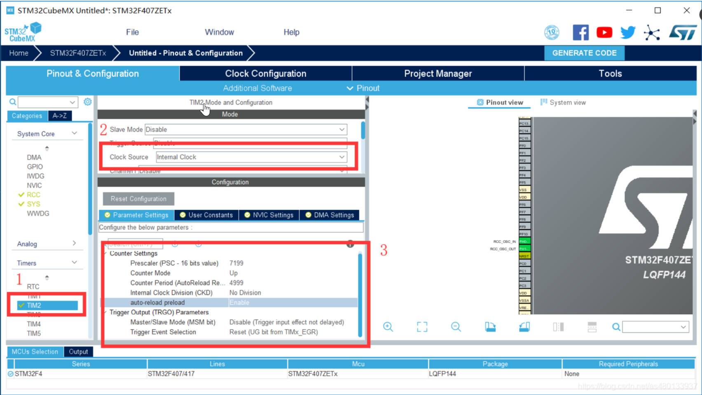

# 06. HAL Library Timer Interrupt


Preface:
Today we are going to learn about timers. The 32-bit timer has a wide range of functions, including input capture/output comparison, PWM, interrupts, etc. It is one of the most frequently used peripherals when we study STM32, so we must master it well. In this section, we will explain timer interrupts. This series of tutorials will combine the corresponding peripheral principles, HAL library and STM32CubeMX to explain , so that you can learn to use each module more quickly.

 

Tools used:

1. Chip: STM32F407ZET6/STM32F103ZET6

2. STM32CubeMx software

3. IDE: MDK-Keil software

4. STM32F1xx/STM32F4xx HAL library 

## Timer Introduction:

The SMT32F1 series has a total of 8 timers:

Advanced timers (TIM1, TIM8); general timers (TIM2, TIM3, TIM4, TIM5); basic timers (TIM6, TIM7).

The SMT32F4 series has a total of 15 timers:

Advanced timers (TIM1, TIM8); general timers (TIM2, TIM3, TIM4, TIM5, TIM9~TIM14); basic timers (TIM6, TIM7).

 

### Basic timer functions (TIM6, TIM7):

 16-bit up, down, up/down auto-load counter
 16-bit programmable (can be modified in real time) prescaler, the counter clock frequency division factor is any value between 1 and 65535
Trigger DAC synchronization circuit  Note: This is a unique function of TIM6/7.
Located on APB1 bus

### The main functions of the general timer (TIM2~TIM5):

 16-bit up, down, up/down auto-load counter
16-bit programmable (can be modified in real time) prescaler, the counter clock frequency division factor is any value between 1 and 65535
The 4 independent channels (TIMx_CH1~4) can be used as:

- ​                  Measuring the pulse length of an input signal (input capture) 
- ​                  Output Compare
- ​                  Single pulse mode output 
- ​                  PWM output (edge or center aligned mode) 

Supports incremental (quadrature) encoder and Hall sensor circuits for positioning 
Interrupts/DMA are generated when the following events occur:

- ​               Update: counter overflow/underflow, counter initialization (by software or internal/external trigger) 
- ​              Trigger event (counter starts, stops, initializes, or counts by internal/external trigger) 
- ​              Input Capture  
- ​              Output Compare  
- ​             Located on APB1 bus

### The main functions of the advanced timer (TIM1, TIM8):

- ​	    Advanced timer has all the functions of basic and general timer.
- ​	    It also has all the functions of controlling AC and DC motors.
-    ​          Output 6 complementary signals with dead zone, brake function, etc.
-    ​           Located on APB2 bus


### Timer counting mode

The general timer can count up, count down, and count in both up and down bidirectional modes.

**Up counting mode**: The counter counts from 0 to the auto-reload value (TIMx_ARR), then restarts counting from 0 and generates a counter overflow event.
**Down counting mode**: The counter starts counting down from the automatically loaded value (TIMx_ARR) to 0, then restarts from the automatically loaded value and generates a counter underflow event.
**Center-aligned mode** (up/down counting): The counter starts counting from 0 to the automatically loaded value -1, generates a counter overflow event, then counts down to 1 and generates a counter overflow event; then it starts counting again from 0.


## Master-slave mode of timer

The timer is usually started by software settings. Each timer of STM32 can also be started by an external signal trigger, or by a condition of another timer . The so-called condition here can be many conditions such as the timing time, timer timeout, comparison success, etc.

This working mode of triggering another timer by one timer is called timer synchronization. The timer that sends the trigger signal works in the master mode , and the timer started by receiving the trigger signal works in the slave mode .


## Project Create

### 1 Setting Up the RCC

**Set the high-speed external clock HSE and select the external clock source**


### 2 Set the Clock


### 3 Timer Setting



#### Enable the Interrupt


Create the Project, That's fine

## Code: 

```c
HAL_TIM_IRQHandler(&htim2);
```

Timer interrupt handling function In the TIM2_IRQHandler() timer interrupt service function of stm32f4xx_it.c

The specific function of this function is to determine whether the interrupt is normal, then determine which type of timer interrupt is generated (overflow interrupt/PWM interrupt...), and then enter the corresponding interrupt callback function

```c
void HAL_TIM_PeriodElapsedCallback(TIM_HandleTypeDef *htim)
```

In the HAL library, after each interruption, the program will not exit immediately, but will enter the interruption callback function.

Here we use the timer overflow interrupt callback function

-  void TIM3_IRQHandler(void) First enter the interrupt function

-  HAL_TIM_IRQHandler(&htim2); then enter the timer interrupt processing function
- Determine which type of timer interrupt (overflow interrupt/PWM interrupt...) and timer channel is generated
-  void HAL_TIM_PeriodElapsedCallback(&htim2); Enter the corresponding interrupt callback function
- Add user code in the interrupt callback function

Routine:
The timer overflow time is 500ms, and the LED lights up and flashes for 500ms 

Initialize and enable timer 2 above the main.c main function

```c
  /* USER CODE BEGIN 2 */
    /*使能定时器1中断*/
    HAL_TIM_Base_Start_IT(&htim2);
  /* USER CODE END 2 */
```

Add an interrupt callback function below the main function in main.c

```c
void HAL_TIM_PeriodElapsedCallback(TIM_HandleTypeDef *htim)
{
    static unsigned char ledState = 0;
    if (htim == (&htim2))
    {
        if (ledState == 0)
            HAL_GPIO_WritePin(GPIOE,GPIO_PIN_15,GPIO_PIN_RESET);
        else
            HAL_GPIO_WritePin(GPIOE,GPIO_PIN_15,GPIO_PIN_SET);
        ledState = !ledState;
    }
}
```

Here's what each part of that line means:

- `htim`: This is a pointer to the `TIM_HandleTypeDef` structure passed to the callback function. This structure contains information about the timer that triggered the interrupt.
- `&htim2`: This is the address of the `htim2` variable. `htim2` is a handle for managing Timer 2 in the STM32 microcontroller. When `HAL_TIM_Base_Start_IT(&htim2)` is called to enable Timer 2 interrupts, it's passing a reference to `htim2` to the HAL library function.
- `if (htim == (&htim2))`: This line compares the pointer `htim`, which points to the `TIM_HandleTypeDef` structure for the timer that triggered the interrupt, with the address of the `htim2` variable. Essentially, it's checking if the timer that triggered the interrupt is Timer 2 (`htim2`).

So, the logic inside the `if` statement is saying: "If the timer that triggered the interrupt is Timer 2 (`htim2`), then toggle the state of the LED connected to GPIO pin PE15." This logic ensures that the LED is toggled only when the interrupt is triggered by Timer 2 and not by any other timer.


## Hal Library Explanation

```c
/**
  * @brief  TIM Time Base Handle Structure definition
  */
#if (USE_HAL_TIM_REGISTER_CALLBACKS == 1)
typedef struct __TIM_HandleTypeDef
#else
typedef struct
#endif /* USE_HAL_TIM_REGISTER_CALLBACKS */
{
  TIM_TypeDef                        *Instance;         /*!< Register base address                             */
  TIM_Base_InitTypeDef               Init;              /*!< TIM Time Base required parameters                 */
  HAL_TIM_ActiveChannel              Channel;           /*!< Active channel                                    */
  DMA_HandleTypeDef                  *hdma[7];          /*!< DMA Handlers array
                                                             This array is accessed by a @ref DMA_Handle_index */
  HAL_LockTypeDef                    Lock;              /*!< Locking object                                    */
  __IO HAL_TIM_StateTypeDef          State;             /*!< TIM operation state                               */
  __IO HAL_TIM_ChannelStateTypeDef   ChannelState[4];   /*!< TIM channel operation state                       */
  __IO HAL_TIM_ChannelStateTypeDef   ChannelNState[4];  /*!< TIM complementary channel operation state         */
  __IO HAL_TIM_DMABurstStateTypeDef  DMABurstState;     /*!< DMA burst operation state                         */

#if (USE_HAL_TIM_REGISTER_CALLBACKS == 1)
  void (* Base_MspInitCallback)(struct __TIM_HandleTypeDef *htim);              /*!< TIM Base Msp Init Callback                              */
  void (* Base_MspDeInitCallback)(struct __TIM_HandleTypeDef *htim);            /*!< TIM Base Msp DeInit Callback                            */
  void (* IC_MspInitCallback)(struct __TIM_HandleTypeDef *htim);                /*!< TIM IC Msp Init Callback                                */
  void (* IC_MspDeInitCallback)(struct __TIM_HandleTypeDef *htim);              /*!< TIM IC Msp DeInit Callback                              */
  void (* OC_MspInitCallback)(struct __TIM_HandleTypeDef *htim);                /*!< TIM OC Msp Init Callback                                */
  void (* OC_MspDeInitCallback)(struct __TIM_HandleTypeDef *htim);              /*!< TIM OC Msp DeInit Callback                              */
  void (* PWM_MspInitCallback)(struct __TIM_HandleTypeDef *htim);               /*!< TIM PWM Msp Init Callback                               */
  void (* PWM_MspDeInitCallback)(struct __TIM_HandleTypeDef *htim);             /*!< TIM PWM Msp DeInit Callback                             */
  void (* OnePulse_MspInitCallback)(struct __TIM_HandleTypeDef *htim);          /*!< TIM One Pulse Msp Init Callback                         */
  void (* OnePulse_MspDeInitCallback)(struct __TIM_HandleTypeDef *htim);        /*!< TIM One Pulse Msp DeInit Callback                       */
  void (* Encoder_MspInitCallback)(struct __TIM_HandleTypeDef *htim);           /*!< TIM Encoder Msp Init Callback                           */
  void (* Encoder_MspDeInitCallback)(struct __TIM_HandleTypeDef *htim);         /*!< TIM Encoder Msp DeInit Callback                         */
  void (* HallSensor_MspInitCallback)(struct __TIM_HandleTypeDef *htim);        /*!< TIM Hall Sensor Msp Init Callback                       */
  void (* HallSensor_MspDeInitCallback)(struct __TIM_HandleTypeDef *htim);      /*!< TIM Hall Sensor Msp DeInit Callback                     */
  void (* PeriodElapsedCallback)(struct __TIM_HandleTypeDef *htim);             /*!< TIM Period Elapsed Callback                             */
  void (* PeriodElapsedHalfCpltCallback)(struct __TIM_HandleTypeDef *htim);     /*!< TIM Period Elapsed half complete Callback               */
  void (* TriggerCallback)(struct __TIM_HandleTypeDef *htim);                   /*!< TIM Trigger Callback                                    */
  void (* TriggerHalfCpltCallback)(struct __TIM_HandleTypeDef *htim);           /*!< TIM Trigger half complete Callback                      */
  void (* IC_CaptureCallback)(struct __TIM_HandleTypeDef *htim);                /*!< TIM Input Capture Callback                              */
  void (* IC_CaptureHalfCpltCallback)(struct __TIM_HandleTypeDef *htim);        /*!< TIM Input Capture half complete Callback                */
  void (* OC_DelayElapsedCallback)(struct __TIM_HandleTypeDef *htim);           /*!< TIM Output Compare Delay Elapsed Callback               */
  void (* PWM_PulseFinishedCallback)(struct __TIM_HandleTypeDef *htim);         /*!< TIM PWM Pulse Finished Callback                         */
  void (* PWM_PulseFinishedHalfCpltCallback)(struct __TIM_HandleTypeDef *htim); /*!< TIM PWM Pulse Finished half complete Callback           */
  void (* ErrorCallback)(struct __TIM_HandleTypeDef *htim);                     /*!< TIM Error Callback                                      */
  void (* CommutationCallback)(struct __TIM_HandleTypeDef *htim);               /*!< TIM Commutation Callback                                */
  void (* CommutationHalfCpltCallback)(struct __TIM_HandleTypeDef *htim);       /*!< TIM Commutation half complete Callback                  */
  void (* BreakCallback)(struct __TIM_HandleTypeDef *htim);                     /*!< TIM Break Callback                                      */
#endif /* USE_HAL_TIM_REGISTER_CALLBACKS */
} TIM_HandleTypeDef;
```

The Structure as follow:

```c
#if (USE_HAL_TIM_REGISTER_CALLBACKS == 1)
typedef struct __TIM_HandleTypeDef
#else
typedef struct
#endif /* USE_HAL_TIM_REGISTER_CALLBACKS */
{
    
}TIM_HandleTypeDef;
```

1. `#if (USE_HAL_TIM_REGISTER_CALLBACKS == 1)`: This preprocessor directive checks if the macro `USE_HAL_TIM_REGISTER_CALLBACKS` is defined and has the value of 1. Macros are used for conditional compilation, allowing parts of the code to be included or excluded based on certain conditions.
2. `typedef struct __TIM_HandleTypeDef`: If `USE_HAL_TIM_REGISTER_CALLBACKS` is defined and set to 1, this line starts a typedef declaration for a structure named `__TIM_HandleTypeDef`. This structure is defined in the subsequent lines.
3. `#else`: This directive specifies what to do if the condition in the `#if` statement is not met, meaning if `USE_HAL_TIM_REGISTER_CALLBACKS` is not equal to 1.
4. `typedef struct`: In this case, if `USE_HAL_TIM_REGISTER_CALLBACKS` is not equal to 1, it defines an anonymous structure without a name.
5. `#endif`: This marks the end of the conditional compilation block. It closes the `#if` directive.
6. `{}`: If `USE_HAL_TIM_REGISTER_CALLBACKS` is defined and equal to 1, this structure contains no members because it is intended to be used with a callback mechanism provided by HAL (Hardware Abstraction Layer) libraries. If the condition is not met, the anonymous structure doesn't have any effect.

in the `timer.c` as you can see

```c
TIM_HandleTypeDef htim2;

/* TIM2 init function */
void MX_TIM2_Init(void)
{

  /* USER CODE BEGIN TIM2_Init 0 */

  /* USER CODE END TIM2_Init 0 */

  TIM_ClockConfigTypeDef sClockSourceConfig = {0};
  TIM_MasterConfigTypeDef sMasterConfig = {0};

  /* USER CODE BEGIN TIM2_Init 1 */

  /* USER CODE END TIM2_Init 1 */
  htim2.Instance = TIM2;
  htim2.Init.Prescaler = 0;
  htim2.Init.CounterMode = TIM_COUNTERMODE_UP;
  htim2.Init.Period = 4294967295;
  htim2.Init.ClockDivision = TIM_CLOCKDIVISION_DIV1;
  htim2.Init.AutoReloadPreload = TIM_AUTORELOAD_PRELOAD_DISABLE;
  if (HAL_TIM_Base_Init(&htim2) != HAL_OK)
  {
    Error_Handler();
  }
  sClockSourceConfig.ClockSource = TIM_CLOCKSOURCE_INTERNAL;
  if (HAL_TIM_ConfigClockSource(&htim2, &sClockSourceConfig) != HAL_OK)
  {
    Error_Handler();
  }
  sMasterConfig.MasterOutputTrigger = TIM_TRGO_RESET;
  sMasterConfig.MasterSlaveMode = TIM_MASTERSLAVEMODE_DISABLE;
  if (HAL_TIMEx_MasterConfigSynchronization(&htim2, &sMasterConfig) != HAL_OK)
  {
    Error_Handler();
  }
  /* USER CODE BEGIN TIM2_Init 2 */

  /* USER CODE END TIM2_Init 2 */

}
```

```c
"
    //STM32_HAL_DEF.h
    /** 
  * @brief  HAL Status structures definition  
  */  
typedef enum 
{
  HAL_OK       = 0x00U,
  HAL_ERROR    = 0x01U,
  HAL_BUSY     = 0x02U,
  HAL_TIMEOUT  = 0x03U
} HAL_StatusTypeDef;

//STM32F4_HAL_TIM.h
HAL_StatusTypeDef HAL_TIM_Base_Start_IT(TIM_HandleTypeDef *htim);

//main.c
HAL_TIM_Base_Start_IT(&htim2);
```


Certainly! Let's break down the relationship between these three parts:

1. **Enumeration (HAL_StatusTypeDef)**:

   - This part defines an enumeration named 

     ```
     HAL_StatusTypeDef
     ```

     , which is used to represent the status of functions in the HAL (Hardware Abstraction Layer) library. It includes four possible status values:

     - `HAL_OK`: Indicates that the operation was successful.
     - `HAL_ERROR`: Indicates that an error occurred during the operation.
     - `HAL_BUSY`: Indicates that the device is busy processing a previous operation.
     - `HAL_TIMEOUT`: Indicates that the operation timed out.

2. **Function Declaration (HAL_TIM_Base_Start_IT)**:

   - This part declares a function named `HAL_TIM_Base_Start_IT`, which is a HAL library function used to start a timer in interrupt mode. It takes a pointer to a `TIM_HandleTypeDef` structure as an argument.

3. **Function Call (`HAL_TIM_Base_Start_IT(&htim2)`)**:

   - This part is an example of calling the `HAL_TIM_Base_Start_IT` function to start a timer in interrupt mode. `&htim2` is passed as an argument to the function, where `htim2` is a handle for managing Timer 2 in the STM32 microcontroller. By passing this handle to the function, it indicates that Timer 2 should be started in interrupt mode.
