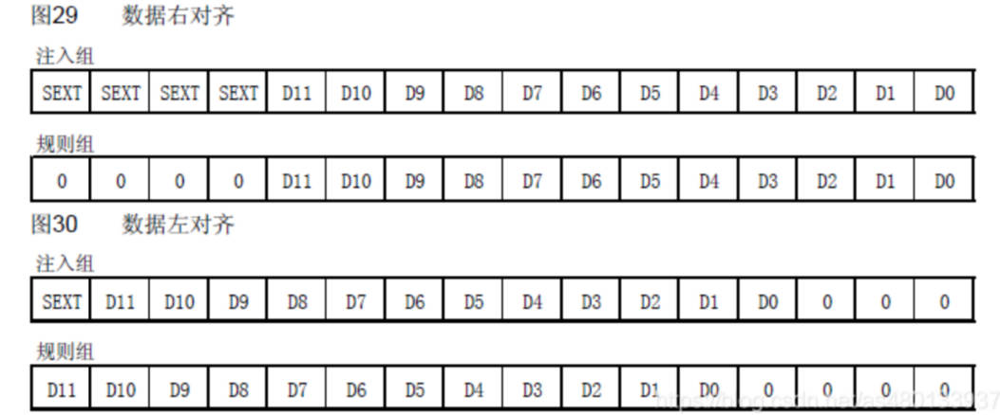

# 09. HAL Library ADC


### Tools used:

1. Chip: STM32F407ZET6/ STM32F103ZET6

2. STM32CubeMx software

3. IDE: MDK-Keil software

4. STM32F1xx/STM32F4xx HAL library

### What is ADC

The abbreviation of Analog-to-Digital Converter. **It refers to an analog/digital converter or an analog/digital converter. It refers to a device that converts a continuous variable analog signal into a discrete digital signal .**

A typical analog-to-digital converter converts an analog signal into a digital signal that represents a proportional voltage value.

Simply put, it converts the analog voltage value into the corresponding value readable by the naked eye.

The 12-bit ADC is a successive approximation analog-to-digital converter. It has 3 ADC controllers , up to 18 channels , and can measure 16 external and 2 internal signal sources. The A/D conversion of each channel can be performed in single, continuous, scan or intermittent mode . The result of the ADC can be stored in a 16-bit data register in left-aligned or right-aligned mode .

12-bit analog-to-digital converter
That is, the digital storage of ADC is 12 bits, which means that the maximum value obtained by the converter through acquisition conversion is 4095. "1111111111111" = 4095. The 12 bits of binary can represent the number 0-4095, which corresponds to the actual value of the measured voltage. If the converted voltage range is 0v-3.3v, the converter will divide 0v-3.3v into 4096 parts. Let the value obtained by the converter be x, and the required voltage value be y.


#### **3 ADC controllers**

That is to say, **STM32 has a total of 3 ADCs** ADC1, ADC2, ADC3


### 18 channels

The STM32 ADC has up to 18 channels,
16 external channels and 2 internal signal sources. You can find out which IO port it is from the manual.

The corresponding relationship between ADC channels and pins of STM32F40x series chips is as follows:


16 external channels : There are 16 pins on the chip that can be connected to analog voltage for voltage value detection.

2 internal signal sources : one is the internal temperature sensor, the other is the internal reference voltage

A total of 23 pins support ADC, including 21 external and 2 internal signal sources


### ADC conversion mode (important, please make sure to understand)

1.Single conversion mode: Suppose you have a temperature sensor connected to channel 0 of the ADC. In single conversion mode, when you need to measure temperature, the ADC performs a conversion to get the data on channel 0, then stops converting until the next trigger.

2.Continuous Conversion Mode: Consider the same temperature sensor, but this time you set the ADC to continuous conversion mode. Once the conversion on channel 0 is completed, the ADC immediately starts the next conversion on the same channel, and so on, repeating the temperature measurement.

3.Scan Mode: Let's say you have four sensors connected to channels 0, 1, 4 and 5. In scan mode, the ADC will convert these four channels in sequence, starting from channel 0, then converting to channel 1, then channel 4, and finally channel 5. If continuous conversion mode is enabled, conversion will restart as soon as channel 5 is completed, continuing from channel 0.

4.Intermittent mode: Taking the same four sensors as an example, you can divide them into two groups: channel 0 and channel 1 are one group, and channel 4 and channel 5 are another group. In discontinuous mode, a trigger signal is required before each set of conversions. For example, a trigger signal initiates conversions on the first group (Channel 0 and Channel 1), then the second group (Channel 4 and Channel 5), and so on until all conversions are complete.


### Align left or right

Because the data obtained by the ADC is 12-bit accurate, but the data is stored in a 16-bit data register, the storage result of the ADC can be divided into left-aligned or right-aligned (12 bits)




## ADC working block diagram


#### 1 Voltage input range


ADC is generally used to collect small voltages, and its input value cannot exceed VDDA , that is, the ADC input range is: VREF- ≤ VIN ≤ VREF+. See the figure above for specific definitions.
Generally, VSSA and VREF- are grounded, VREF+ and VDDA are connected to 3V3, then the ADC input range is 0~3.3V

### 2 ADC input channels

ADCx_INT0-ADCx_INT15 correspond to the 16 external channels of the three ADCs for analog signal conversion . In addition, there are two internal channels: temperature detection or internal voltage detection.
After selecting the corresponding channel, the corresponding GPIO pin will be selected . The relevant pin definitions and descriptions can be found in the data sheet of the development board.

### 3 Injection channel, regular channel

We see that after selecting the relevant channel pin of the ADC, there are two channels in the analog-to-digital converter, the injection channel and
the regular channel. The regular channels can be up to 16 and the injection channels can be up to 4.

Rules channel:

The rule channel is equivalent to your normally running program. You can tell from its name that it is very regular, that is, the normal execution program
injection channel: the injection channel can interrupt the rule channel. You can tell from its name that it is restless. If there is an injection channel to convert during the rule channel conversion process , then you must convert the injection channel first, and then return to the rule channel conversion process after the injection channel conversion is completed.


### 4 ADC clock

The ADCCLK of the ADC prescaler in the figure is the clock source of the ADC module . Usually, the ADCCLK clock provided by the clock controller is synchronized with PCLK2 (APB2 clock). The RCC controller provides a dedicated programmable prescaler for the ADC clock. The division factor is configured by ADCPRE[1:0] of RCC_CFGR, which can be configured as 2/4/6/8 divisions.

The maximum conversion rate of STM32's ADC is 1MHz, which means the fastest conversion time is 1us. In order to ensure the accuracy of the ADC conversion results, the ADC clock should not exceed 14M.

```
T = sampling time + 12.5 cycles, where 1 cycle is 1/ADCCLK
```

For example, when ADCCLK=14Mhz, and set the sampling time to 1.5 cycles, we get: Tcovn=1.5+12.5=14 cycles=1us.

### 5 External trigger conversion

ADC conversion can be controlled by the ADON bit of ADC control register 2: ADC_CR2. Writing 1 starts the conversion and writing 0 stops the conversion.

Of course, in addition to the ADON bit of the ADC_CR2 register controlling the start and stop of the conversion, it can also support external event triggering conversion (such as timer capture, EXTI line)

Including internal timer trigger and external IO trigger . The specific trigger source is controlled by the EXTSEL[2:0] bit ( regular channel trigger source ) and JEXTSEL[2:0] bit ( injection channel trigger source ) of ADC_CR2.

At the same time, the trigger source of ADC3 is different from that of ADC1/2, as shown in the figure above.

Please refer to the block diagram in Part 5 for details.

### 6 Interrupt

There are three interrupt trigger conditions: the regular channel conversion ends , the injection channel conversion ends , or the analog watchdog status bit is set .

### DMA

At the same time, ADC also supports DMA triggering. After the conversion of the rules and injection channels is completed, a DMA request will be generated to transfer the converted data to the memory.

Note that only ADC1 and ADC3 can generate DMA requests.

Because it involves DMA transmission, we will not introduce it in detail here. DMA will be updated in the next few sections. Generally, we will enable DMA transmission when using ADC.


## STM32F10x ADC Features

12-bit successive approximation analog-to-digital converter.
With up to 3 ADC controllers
Supports up to 18 channels and can measure up to 16 external and 2 internal signal sources.
Supports single and continuous conversion modes
Interrupts are generated at the end of conversion, the end of injected conversion, and on simulated watchdog events.
Automatic calibration in auto scan mode from channel 0 to channel n
Sampling interval can be programmed per channel
External trigger option for both regular and injected channels
The conversion result can be stored in the 16-bit data register in left-aligned or right-aligned mode.
ADC conversion time: Maximum conversion rate 1us. (The maximum conversion speed is 1MHz, obtained when ADCCLK=14M and the sampling period is 1.5 ADC clocks.)
ADC power supply requirement: 2.4V-3.6V
ADC input range: VREF- ≤ VIN ≤ VREF+

## Difference between F1 and F4

The F4 ADC supports 12-bit, 10-bit, 8-bit and 6-bit precision, while the F1 only supports 12-bit.

Both F1 and F4 have 3 ADCs, F1 can provide 21 input channels, and F4 can provide 24 input channels.

The maximum ADC sampling frequency of F1 is 1Msps, and 2-way alternating sampling can reach 2Msps (F1 does not support 3-way alternating sampling). The maximum ADC sampling frequency of F4 is 2.4Msps, and 3-way alternating sampling can reach 7.2Msps.

Now it’s time to create CubeMax


## CubeMax

.............................................................................

https://blog.csdn.net/as480133937/article/details/99627062

**Set the ADC pin.**


## Routine:

Add in main.c

```c
  /* USER CODE BEGIN 0 */
	uint16_t ADC_Value;
  /* USER CODE END 0 */
```

Add AD calibration function after ADC initialization

```c
  MX_ADC1_Init();
	HAL_ADCEx_Calibration_Start(&hadc1);    //AD校准
  MX_USART1_UART_Init();
  /* USER CODE BEGIN 2 */
```

Add the following to while:

```c
 HAL_ADC_Start(&hadc1);     //启动ADC转换
 HAL_ADC_PollForConversion(&hadc1, 50);   //等待转换完成，50为最大等待时间，单位为ms
 
 
 if(HAL_IS_BIT_SET(HAL_ADC_GetState(&hadc1), HAL_ADC_STATE_REG_EOC))
 {
  ADC_Value = HAL_ADC_GetValue(&hadc1);   //获取AD值

  printf("ADC1 Reading : %d \r\n",ADC_Value);
  printf("PA3 True Voltage value : %.4f \r\n",ADC_Value*3.3f/4096);
  printf("Z小旋测试\r\n");
}
HAL_Delay(1000);
```


**and interrupt reading:**

If the ADC conversion end interrupt is enabled and the timer interrupt is enabled, you can write:

```c
// adc.c
void HAL_TIM_PeriodElapsedCallback(TIM_HandleTypeDef *htim)    //定时器中断回调
{
    HAL_ADC_Start_IT(&hadc1); //定时器中断里面开启ADC中断转换，1ms开启一次采集    
}

void HAL_ADC_ConvCpltCallback(ADC_HandleTypeDef* hadc)    //ADC转换完成回调
{
    HAL_ADC_Stop_IT(&hadc1);    　　　　//关闭ADC
    HAL_TIM_Base_Stop_IT(&htim3);　　  //关闭定时器
    AD_Value=HAL_ADC_GetValue(&hadc1);　　//获取ADC转换的值

    printf("ADC1 Reading : %d \r\n",AD_Value);
    printf("%.4f V\r\n",(AD_Value*3.3/4096));　　　  //串口打印电压信息
    HAL_TIM_Base_Start_IT(&htim3); 　　　　  //开启定时器
}
```


## HAL Code

### MX_ADC1_Init()

```c
void MX_ADC1_Init(void)
{

  /* USER CODE BEGIN ADC1_Init 0 */

  /* USER CODE END ADC1_Init 0 */

  ADC_ChannelConfTypeDef sConfig = {0};

  /* USER CODE BEGIN ADC1_Init 1 */

  /* USER CODE END ADC1_Init 1 */

  /** Configure the global features of the ADC (Clock, Resolution, Data Alignment and number of conversion)
  */
  hadc1.Instance = ADC1;
  hadc1.Init.ClockPrescaler = ADC_CLOCK_SYNC_PCLK_DIV4;
  hadc1.Init.Resolution = ADC_RESOLUTION_12B;
  hadc1.Init.ScanConvMode = DISABLE;
  hadc1.Init.ContinuousConvMode = ENABLE;
  hadc1.Init.DiscontinuousConvMode = DISABLE;
  hadc1.Init.ExternalTrigConvEdge = ADC_EXTERNALTRIGCONVEDGE_NONE;
  hadc1.Init.ExternalTrigConv = ADC_SOFTWARE_START;
  hadc1.Init.DataAlign = ADC_DATAALIGN_RIGHT;
  hadc1.Init.NbrOfConversion = 1;
  hadc1.Init.DMAContinuousRequests = DISABLE;
  hadc1.Init.EOCSelection = ADC_EOC_SINGLE_CONV;
  if (HAL_ADC_Init(&hadc1) != HAL_OK)
  {
    Error_Handler();
  }

  /** Configure for the selected ADC regular channel its corresponding rank in the sequencer and its sample time.
  */
  sConfig.Channel = ADC_CHANNEL_3;
  sConfig.Rank = 1;
  sConfig.SamplingTime = ADC_SAMPLETIME_3CYCLES;
  if (HAL_ADC_ConfigChannel(&hadc1, &sConfig) != HAL_OK)
  {
    Error_Handler();
  }
  /* USER CODE BEGIN ADC1_Init 2 */

  /* USER CODE END ADC1_Init 2 */

}
```

#### hadc1 Explanation

```c
//stm32f4xx_hal_adc.h
//ADC_HandleTypeDef hadc1
/**
  * @brief  ADC handle Structure definition
  */
#if (USE_HAL_ADC_REGISTER_CALLBACKS == 1)
typedef struct __ADC_HandleTypeDef
#else
typedef struct
#endif
{
  ADC_TypeDef                   *Instance;                   /*!< Register base address */

  ADC_InitTypeDef               Init;                        /*!< ADC required parameters */

  __IO uint32_t                 NbrOfCurrentConversionRank;  /*!< ADC number of current conversion rank */

  DMA_HandleTypeDef             *DMA_Handle;                 /*!< Pointer DMA Handler */

  HAL_LockTypeDef               Lock;                        /*!< ADC locking object */

  __IO uint32_t                 State;                       /*!< ADC communication state */

  __IO uint32_t                 ErrorCode;                   /*!< ADC Error code */
#if (USE_HAL_ADC_REGISTER_CALLBACKS == 1)
  void (* ConvCpltCallback)(struct __ADC_HandleTypeDef *hadc);              /*!< ADC conversion complete callback */
  void (* ConvHalfCpltCallback)(struct __ADC_HandleTypeDef *hadc);          /*!< ADC conversion DMA half-transfer callback */
  void (* LevelOutOfWindowCallback)(struct __ADC_HandleTypeDef *hadc);      /*!< ADC analog watchdog 1 callback */
  void (* ErrorCallback)(struct __ADC_HandleTypeDef *hadc);                 /*!< ADC error callback */
  void (* InjectedConvCpltCallback)(struct __ADC_HandleTypeDef *hadc);      /*!< ADC group injected conversion complete callback */
  void (* MspInitCallback)(struct __ADC_HandleTypeDef *hadc);               /*!< ADC Msp Init callback */
  void (* MspDeInitCallback)(struct __ADC_HandleTypeDef *hadc);             /*!< ADC Msp DeInit callback */
#endif /* USE_HAL_ADC_REGISTER_CALLBACKS */
} ADC_HandleTypeDef;
```

### Hadc1.init Explanation

```c
typedef struct
{
  uint32_t ClockPrescaler;               /*!< Select ADC clock prescaler. The clock is common for
                                              all the ADCs.
                                              This parameter can be a value of @ref ADC_ClockPrescaler */
  uint32_t Resolution;                   /*!< Configures the ADC resolution.
                                              This parameter can be a value of @ref ADC_Resolution */
  uint32_t DataAlign;                    /*!< Specifies ADC data alignment to right (MSB on register bit 11 and LSB on register bit 0) (default setting)
                                              or to left (if regular group: MSB on register bit 15 and LSB on register bit 4, if injected group (MSB kept as signed value due to potential negative value after offset application): MSB on register bit 14 and LSB on register bit 3).
                                              This parameter can be a value of @ref ADC_Data_align */
  uint32_t ScanConvMode;                 /*!< Configures the sequencer of regular and injected groups.
                                              This parameter can be associated to parameter 'DiscontinuousConvMode' to have main sequence subdivided in successive parts.
                                              If disabled: Conversion is performed in single mode (one channel converted, the one defined in rank 1).
                                                           Parameters 'NbrOfConversion' and 'InjectedNbrOfConversion' are discarded (equivalent to set to 1).
                                              If enabled:  Conversions are performed in sequence mode (multiple ranks defined by 'NbrOfConversion'/'InjectedNbrOfConversion' and each channel rank).
                                                           Scan direction is upward: from rank1 to rank 'n'.
                                              This parameter can be set to ENABLE or DISABLE */
  uint32_t EOCSelection;                 /*!< Specifies what EOC (End Of Conversion) flag is used for conversion by polling and interruption: end of conversion of each rank or complete sequence.
                                              This parameter can be a value of @ref ADC_EOCSelection.
                                              Note: For injected group, end of conversion (flag&IT) is raised only at the end of the sequence.
                                                    Therefore, if end of conversion is set to end of each conversion, injected group should not be used with interruption (HAL_ADCEx_InjectedStart_IT)
                                                    or polling (HAL_ADCEx_InjectedStart and HAL_ADCEx_InjectedPollForConversion). By the way, polling is still possible since driver will use an estimated timing for end of injected conversion.
                                              Note: If overrun feature is intended to be used, use ADC in mode 'interruption' (function HAL_ADC_Start_IT() ) with parameter EOCSelection set to end of each conversion or in mode 'transfer by DMA' (function HAL_ADC_Start_DMA()).
                                                    If overrun feature is intended to be bypassed, use ADC in mode 'polling' or 'interruption' with parameter EOCSelection must be set to end of sequence */
  FunctionalState ContinuousConvMode;    /*!< Specifies whether the conversion is performed in single mode (one conversion) or continuous mode for regular group,
                                              after the selected trigger occurred (software start or external trigger).
                                              This parameter can be set to ENABLE or DISABLE. */
  uint32_t NbrOfConversion;              /*!< Specifies the number of ranks that will be converted within the regular group sequencer.
                                              To use regular group sequencer and convert several ranks, parameter 'ScanConvMode' must be enabled.
                                              This parameter must be a number between Min_Data = 1 and Max_Data = 16. */
  FunctionalState DiscontinuousConvMode; /*!< Specifies whether the conversions sequence of regular group is performed in Complete-sequence/Discontinuous-sequence (main sequence subdivided in successive parts).
                                              Discontinuous mode is used only if sequencer is enabled (parameter 'ScanConvMode'). If sequencer is disabled, this parameter is discarded.
                                              Discontinuous mode can be enabled only if continuous mode is disabled. If continuous mode is enabled, this parameter setting is discarded.
                                              This parameter can be set to ENABLE or DISABLE. */
  uint32_t NbrOfDiscConversion;          /*!< Specifies the number of discontinuous conversions in which the  main sequence of regular group (parameter NbrOfConversion) will be subdivided.
                                              If parameter 'DiscontinuousConvMode' is disabled, this parameter is discarded.
                                              This parameter must be a number between Min_Data = 1 and Max_Data = 8. */
  uint32_t ExternalTrigConv;             /*!< Selects the external event used to trigger the conversion start of regular group.
                                              If set to ADC_SOFTWARE_START, external triggers are disabled.
                                              If set to external trigger source, triggering is on event rising edge by default.
                                              This parameter can be a value of @ref ADC_External_trigger_Source_Regular */
  uint32_t ExternalTrigConvEdge;         /*!< Selects the external trigger edge of regular group.
                                              If trigger is set to ADC_SOFTWARE_START, this parameter is discarded.
                                              This parameter can be a value of @ref ADC_External_trigger_edge_Regular */
  FunctionalState DMAContinuousRequests; /*!< Specifies whether the DMA requests are performed in one shot mode (DMA transfer stop when number of conversions is reached)
                        or in Continuous mode (DMA transfer unlimited, whatever number of conversions).
                        Note: In continuous mode, DMA must be configured in circular mode. Otherwise an overrun will be triggered when DMA buffer maximum pointer is reached.
                        Note: This parameter must be modified when no conversion is on going on both regular and injected groups (ADC disabled, or ADC enabled without continuous mode or external trigger that could launch a conversion).
                        This parameter can be set to ENABLE or DISABLE. */
} ADC_InitTypeDef;
```


