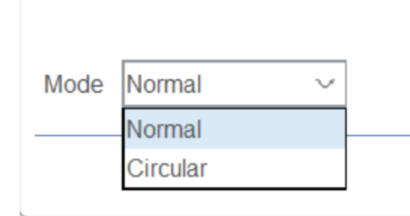

# 11. HAL Library DMA


## DMA Introduction

**DMA, the full name of which is Direct Memory Access, is Direct Memory Access.**

**DMA transfers copy data from one address space to another, providing high-speed data transfer between peripherals and memory or between memory and memory .**

We know that the CPU has many functions such as transferring data, calculating, and controlling program transfer. The core of the system operation is the CPU .

The CPU is processing a large number of transactions all the time, but some things are not that important, such as data replication and storage. If we take out this part of the CPU resources and let the CPU handle other complex computing tasks, can we make better use of the CPU resources?

Therefore, data transfer (especially large amounts of data transfer) can be done without CPU involvement. For example, if you want to copy data from peripheral A to peripheral B, **you only need to provide a data path for the two peripherals, and directly copy data from A to B without CPU processing** .


**DMA definition:**
**DMA is used to provide high-speed data transfer between peripherals and memory or between memory and memory. Data can be moved quickly through DMA without CPU intervention. This saves CPU resources for other operations.**

**DMA transfer mode:**
The role of DMA is to realize direct data transmission, and remove the traditional data transmission that requires the participation of CPU registers . It mainly involves four types of data transmission, but they are essentially the same, all of which are transferred from one area of memory to another area of memory (the data register of the peripheral is essentially a storage unit of the memory). The four types of data transmission are as follows:

- Peripherals to memory

- Memory to peripherals
- Memory to Memory
- Peripheral to Peripheral

**DMA transfer parameters**
As we know, data transmission first requires **1. the source address of the data** **2. the target address of the data transmission location** **3. the data transmission volume of the data to be transferred** **4. the transmission mode of how many times the data is transferred** ,  The core parameters required by DMA are these four demands.

When the user sets the parameters, mainly involving the source address, target address, and the amount of data to be transferred , the DMA controller will start the data transfer. When the remaining amount of data to be transferred is 0, the transfer end point is reached and the DMA transfer ends. Of course, DMA also has a cyclic transfer mode, which will restart the DMA transfer when the transfer end point is reached.
　　
In other words, as long as the remaining amount of data to be transferred is not 0 and the DMA is in the enabled state, data transfer will occur.　


**Main characteristics of DMA**
Each channel is directly connected to a dedicated hardware DMA request, and each channel also supports software triggering. These functions are configured through software;

- On the same DMA module, the priority between multiple requests can be set by software programming (there are four levels: very high, high, medium and low). When the priority settings are equal, they are determined by hardware (request 0 takes precedence over request 1, and so on);
- Independent data transfer width (byte, half-word, full-word) of the data source and target data area, simulating the process of packing and unpacking. The source and target addresses must be aligned according to the data transfer width;
- Support circular buffer management;
- Each channel has three event flags (DMA half transfer, DMA transfer completion and DMA transfer error). These three event flags are logically or combined into a single interrupt request.
- Transfer between memory and memory, transfer between peripheral and memory, and transfer between memory and peripheral;
- Flash, SRAM, peripheral SRAM, APB1, APB2 and AHB peripherals can be used as source and destination for access;
- Programmable number of data transfers: Maximum 65535.

### Does STM32 lack DMA resources?

For large-capacity STM32 chips, there are two DMA controllers, DMA1 has 7 channels, and DMA2 has 5 channels.
Each channel can be configured with the address of specific peripherals.

**①DMA1 controller**

Seven DMA requests generated from peripherals (TIMx[x=1, 2, 3, 4], ADC1, SPI1, SPI/I2S2, I2Cx[x=1, 2] and USARTx[x=1, 2, 3]) are input to the DMA1 controller through logical OR, where each channel corresponds to a specific peripheral:


**② DMA2 controller**

Five requests generated from peripherals (TIMx[5, 6, 7, 8], ADC3, SPI/I2S3, UART4, DAC channels 1, 2, and SDIO) are logically ORed into the DMA2 controller, where each channel corresponds to a specific peripheral:


## DMA working system block diagram


In the block diagram above, we can see the connection between the STM32 core, memory, peripherals and DMA. These hardware are finally connected to the bus matrix through various lines. The data transfer between the hardware structures is coordinated by the bus matrix, so that each peripheral uses the bus to transfer data harmoniously.
Let's analyze it bit by bit:

Let's see how the data collected by ADC is stored in SRAM with and without DMA.
**No DMA**

If there is no DMA, the CPU still needs to use the kernel as a transfer station to transfer data. For example, if you want to transfer the data collected by ADC to SRAM, the process is as follows:

The Kernel uses DCode to coordinate through the bus matrix to obtain the data collected by the peripheral ADC stored in the AHB,

and then the core uses DCode to coordinate through the bus matrix to store the data in the memory SRAM.


**With DMA transfer**

If there is DMA,

1. During DMA transfer, the peripheral sends a request to the **DMA controller**.
2. The DMA controller receives the request and triggers DMA operation.
3. The DMA controller obtains the data collected by the ADC from the AHB peripheral and stores it in the DMA channel
4. The DMA bus of the DMA controller coordinates with the bus matrix and uses AHB to store the data collected by the peripheral ADC into the SRAM via the DMA channel. During the data transmission process, the kernel does not need to be involved at all, that is, the CPU does not need to be involved.


Let's introduce the above steps in a more professional way:

After an event occurs, the peripheral sends a request signal to the DMA controller . The DMA controller processes the request according to the priority of the channel. When the DMA controller starts to access the peripheral that issued the request, the DMA controller immediately sends it an acknowledge signal . When receiving the acknowledge signal from the DMA controller, the peripheral immediately releases its request. Once the peripheral releases the request, the DMA controller also cancels the acknowledge signal. **The DMA transfer ends** , and if there are more requests, the peripheral can start the next cycle.

In summary, each DMA transfer consists of three operations:

- **Fetch data from the peripheral data register or from the memory address indicated by the current peripheral/memory address register. The starting address for the first transfer is the peripheral base address or memory unit specified by the DMA_CPARx or DMA_CMARx register.**

- **Store data to the peripheral data register or the memory address indicated by the current peripheral/memory address register. The starting address for the first transfer is the peripheral base address or memory unit specified by the DMA_CPARx or DMA_CMARx register.**
- **Performs a decrement of the DMA_CNDTRx register, which contains the number of outstanding operations .**

**DMA transfer mode**
Method 1: DMA_Mode_Normal , normal mode,

When a DMA data transfer is completed, stop DMA transfer, that is, only transfer once.
　　
Method 2: DMA_Mode_Circular , circular transfer mode

When the transmission is finished, the hardware will automatically reload the transfer data amount register and start the next round of data transmission.


### Arbitrator


**The role of the arbitrator is to determine the priority of each DMA transfer**

The arbiter initiates peripheral/memory access based on the priority of channel requests.

Priority management is divided into two stages:

Software: The priority of each channel can be set in the DMA_CCRx register, there are 4 levels:

Highest priority
high priority
Medium priority
Low priority;
Hardware: If two requests have the same software priority, the lower numbered channel has higher priority than the higher numbered channel. For example: if the software priority is the same, channel 2 takes precedence over channel 4.

Note: In large capacity products and interconnect products, the DMA1 controller has a higher priority than the DMA2 controller.

### Pointer increment mode

Depending on the state of the PINC and MINC bits in the DMA_SxCR register, the peripheral and memory pointers can automatically increment backwards or remain constant after each transfer. When set to incremental mode, the next address to be transferred will be the previous address plus the increment value.

Disabling Increment mode is useful when accessing peripheral source or destination data through a single register.

If the increment mode is enabled, the address of the next transfer will be the address of the previous transfer incremented by 1 data width, 2 data widths, or 4 data widths, depending on the data width programmed in the PSIZE or MSIZE bits of the DMA_SxCR register.

### Memory to Memory Mode

The DMA channel can operate without a peripheral request, which is the memory-to-memory mode.

After the MEM2MEM bit in the DMA_CCRx register is set, DMA transfer will start immediately when the software sets the EN bit in the DMA_CCRx register to start the DMA channel. DMA transfer ends when the DMA_CNDTRx register becomes 0. Memory-to-memory mode cannot be used simultaneously with circular mode.

It should be noted here that only the DMA2 peripheral interface can access the memory, so only the DMA2 controller supports memory-to-memory transfers, not DMA1.

Memory-to-memory mode cannot be used simultaneously with circular mode.

### DMA Interrupts

Each DMA channel can generate an interrupt when the DMA transfer is halfway through, when the transfer is complete, and when a transfer error occurs. For application flexibility, these interrupts can be enabled by setting different bits of the register.


Even if it is not enabled, we can still query these bits to get the current DMA transfer status. Here we often use the TCIFx bit, which is the flag for whether the DMA transfer of data stream x is completed.

DMA library function configuration process:
1. Enable DMA clock: RCC_AHBPeriphClockCmd();

2. Initialize DMA channel: DMA_Init();

// Set the channel; transmission address; transmission direction; number of transmission data; transmission data width; transmission mode; priority; whether to enable memory to memory.

3. Enable peripheral DMA;

4. Enable DMA channel transmission;

5. Query the DMA transfer status.

We only introduce DMA here. If you need a more detailed understanding of DMA principles, DMA registers and library functions, you can refer to this article

**Next we will introduce how CubeMx creates DMA**

**The specific process is as follows:**


## Project Creation

### 1Set the RCC


Set high-speed external clock HSE Select external clock source

**2Set up the serial port**


1 Click USATR1
2Set MODE to Asynchronous communication
3 Basic parameters: Baud rate is 115200 Bits/s. Transmission data length is 8 Bit. Parity check is none, stop bit is 1. Both receiving and sending are enabled.
4GPIO pins automatically set USART1_RX/USART_TX
5 NVIC Settings column enables the receive interrupt. 


**3 DMA settings**


According to the DMA channel preview, we can know that the TX and RX of USART1 we use correspond to channel 4 and channel 5 of DMA1 respectively.

- Click DMASettings and click Add to add a channel.

- Select USART_RX USART_TX transmission rate to set to medium speed
- DMA transfer mode is normal mode
- DMA memory address increases by one Byte each time

#### 1DMA basic settings

Click System Core on the right and click DMA


DMA Request : Corresponding peripherals for DMA transfer

Note: If you add DMA in the DMA settings interface without turning on the corresponding peripheral, the default is MENTOMEN

Channel DMA transmission channel settings
DMA1: DMA1 Channel 0~DMA1 Channel 7
DMA2: DMA2 Channel 1~DMA1 Channel 5

Dirction: DMA transfer direction
There are four transfer directions:

Peripheral To Memory
Memory To Peripheral
Memory To Memory
Peripheral To Peripheral
Priority: Transmission speed

Very Hight
High priority
Medium priority
Low priority;

**2DMA transfer mode**



Normal: Normal mode
When a DMA data transfer is completed, stop DMA transfer, that is, only transfer once

Circular： Circular mode

After the transmission is completed, it will start again and continue to transmit, and the cycle will never stop.

#### 3DMA pointer increment setting


Increment Address: address pointer increment (introduced above).

The left Src Memory indicates the peripheral address register

Function: Set whether the peripheral address remains unchanged or increases when transmitting data. If it is set to increase, the address will increase by Data Width bytes during the next transmission.

The Dst Memory on the right indicates the memory address register

Function: Set whether the memory address is incremented when transmitting data. If it is set to increment, the address will be increased by Data Width bytes during the next transmission.

This is the same as Src Memory, but it is for memory.

**The serial port sends data by continuously storing the data into the serial port's transmit data register (USARTx_TDR) which has  a fixed peripheral address. Therefore, the address of the peripheral does not increase.**

**The internal memory stores the data to be sent, so the address pointer must be incremented to ensure that the data is sent out in sequence.**


Just be careful not to get the DMA transfer direction wrong, whether it is PERIPHERIAL to MEMORY or MEMORY to PERIPHERIAL or Memory to Memory, it must be configured correctly. Especially when using CubeMx configuration, there is a default configuration of PERIPHERIAL to MEMORY. If your real intention is not from PERIPHERIAL to MEMORY, and you accidentally use this default configuration, the result is predictable, DMA transfer can not run normally.
**4 Clock source settings**


**5. Project File Setup**

**6. Create project files**


## **Test routine 1**

In main.C add:

```c
 /* USER CODE BEGIN Init */
	uint8_t Senbuff[] = "\r\n**** Serial Output Message by DMA ***\r\n   UART DMA Test \r\n   Zxiaoxuan";  //定义数据发送数组
  /* USER CODE END Init */
```

While loop:

```c
  while (1)
  {
    /* USER CODE END WHILE */
			HAL_UART_Transmit_DMA(&huart1, (uint8_t *)Senbuff, sizeof(Senbuff));
	        HAL_Delay(1000);
    /* USER CODE BEGIN 3 */
  }
```

The serial port assistant test is normal:


Note: If the serial port interrupt is not enabled, the program can only send data once, and the program cannot determine whether the DMA transfer is completed, and the USART is always in a busy state.

**Introduction to HAL library UARTDMA function library**


HAL_UART_Transmit() ; Serial port sends data, using timeout management mechanism
HAL_UART_Receive() ; Receive data via serial port, using timeout management mechanism
HAL_UART_Transmit_IT() ;Serial port interrupt mode transmission
HAL_UART_Receive_IT() ; Receive in serial port interrupt mode
HAL_UART_Transmit_DMA() ;Serial port DMA mode transmission
HAL_UART_Transmit_DMA() ; Serial port DMA mode reception
HAL_UART_DMAPause() pauses serial port DMA
HAL_UART_DMAResume() ; Resume serial port DMA
HAL_UART_DMAStop() ; End serial port DMA
Because this part of the function has been explained when explaining USART, we will not introduce it in detail here. If it is different, please see the corresponding blog post of UART , which is very detailed.

## Test routine 2

STM32 IDLE receives idle interrupt

The interrupt condition of STM32 IDLE: If there is no data received at the serial port, it will not be generated. After the IDLE flag is cleared, it must be triggered after the first data is received. Once the received data is interrupted, no data is received, and an IDLE interrupt is generated.

This routine function:

Use DMA+serial port to receive idle interrupt to send the received data to the host computer completely

Routine code:

uart.c

```c
volatile uint8_t rx_len = 0;  //接收一帧数据的长度
volatile uint8_t recv_end_flag = 0; //一帧数据接收完成标志
uint8_t rx_buffer[100]={0};  //接收数据缓存数组
```

```c
void MX_USART1_UART_Init(void)
{

  huart1.Instance = USART1;
  huart1.Init.BaudRate = 115200;
  huart1.Init.WordLength = UART_WORDLENGTH_8B;
  huart1.Init.StopBits = UART_STOPBITS_1;
  huart1.Init.Parity = UART_PARITY_NONE;
  huart1.Init.Mode = UART_MODE_TX_RX;
  huart1.Init.HwFlowCtl = UART_HWCONTROL_NONE;
  huart1.Init.OverSampling = UART_OVERSAMPLING_16;
  if (HAL_UART_Init(&huart1) != HAL_OK)
  {
    Error_Handler();
  }
//下方为自己添加的代码
	__HAL_UART_ENABLE_IT(&huart1, UART_IT_IDLE); //使能IDLE中断

//DMA接收函数，此句一定要加，不加接收不到第一次传进来的实数据，是空的，且此时接收到的数据长度为缓存器的数据长度
	HAL_UART_Receive_DMA(&huart1,rx_buffer,BUFFER_SIZE);

	
}
```

**uart.h**

```c
extern UART_HandleTypeDef huart1;
extern DMA_HandleTypeDef hdma_usart1_rx;
extern DMA_HandleTypeDef hdma_usart1_tx;
/* USER CODE BEGIN Private defines */
 
 
#define BUFFER_SIZE  100  
extern  volatile uint8_t rx_len ;  //接收一帧数据的长度
extern volatile uint8_t recv_end_flag; //一帧数据接收完成标志
extern uint8_t rx_buffer[100];  //接收数据缓存数组
```

**main.c**

```c
/*
*********************************************************************************************************
* 函 数 名: DMA_Usart_Send
* 功能说明: 串口发送功能函数
* 形  参: buf，len
* 返 回 值: 无
*********************************************************************************************************
*/
void DMA_Usart_Send(uint8_t *buf,uint8_t len)//串口发送封装
{
 if(HAL_UART_Transmit_DMA(&huart1, buf,len)!= HAL_OK) //判断是否发送正常，如果出现异常则进入异常中断函数
  {
   Error_Handler();
  }

}


/*
*********************************************************************************************************
* 函 数 名: DMA_Usart1_Read
* 功能说明: 串口接收功能函数
* 形  参: Data,len
* 返 回 值: 无
*********************************************************************************************************
*/
void DMA_Usart1_Read(uint8_t *Data,uint8_t len)//串口接收封装
{
	HAL_UART_Receive_DMA(&huart1,Data,len);//重新打开DMA接收
}
```

**While Loop**

```c
 while (1)
  {
    /* USER CODE END WHILE */

    /* USER CODE BEGIN 3 */
		 if(recv_end_flag == 1)  //接收完成标志
		{
			
			
			DMA_Usart_Send(rx_buffer, rx_len);
			rx_len = 0;//清除计数
			recv_end_flag = 0;//清除接收结束标志位
//			for(uint8_t i=0;i<rx_len;i++)
//				{
//					rx_buffer[i]=0;//清接收缓存
//				}
				memset(rx_buffer,0,rx_len);
  }
		HAL_UART_Receive_DMA(&huart1,rx_buffer,BUFFER_SIZE);//重新打开DMA接收
}
```

**stm32f1xx_it.c**

```c
#include "usart.h"

void USART1_IRQHandler(void)
{
	uint32_t tmp_flag = 0;
	uint32_t temp;
	tmp_flag =__HAL_UART_GET_FLAG(&huart1,UART_FLAG_IDLE); //获取IDLE标志位
	if((tmp_flag != RESET))//idle标志被置位
	{ 
		__HAL_UART_CLEAR_IDLEFLAG(&huart1);//清除标志位
		//temp = huart1.Instance->SR;  //清除状态寄存器SR,读取SR寄存器可以实现清除SR寄存器的功能
		//temp = huart1.Instance->DR; //读取数据寄存器中的数据
		//这两句和上面那句等效
		HAL_UART_DMAStop(&huart1); //
		temp  =  __HAL_DMA_GET_COUNTER(&hdma_usart1_rx);// 获取DMA中未传输的数据个数   
		//temp  = hdma_usart1_rx.Instance->NDTR;//读取NDTR寄存器 获取DMA中未传输的数据个数，
		//这句和上面那句等效
		rx_len =  BUFFER_SIZE - temp; //总计数减去未传输的数据个数，得到已经接收的数据个数
		recv_end_flag = 1;	// 接受完成标志位置1	
	 }
  HAL_UART_IRQHandler(&huart1);

}
```

